###### Onboarding Apache Web Server Logs


- [ ] Here Spidering means making a copy of every page of website.
- [ ] Scanning = Vulnerability Scanning/ Missing configuration pages etc

`Task:`
- [ ] Install Apache Web Servers on Ubuntu Server 
- [ ] Configure Log Format for Apache
- [ ] Install the Apache Add-on on the Splunk Host
- [ ] Need to Configure `inputs.conf` on the UF

```shell
 sudo apt install apache2
```

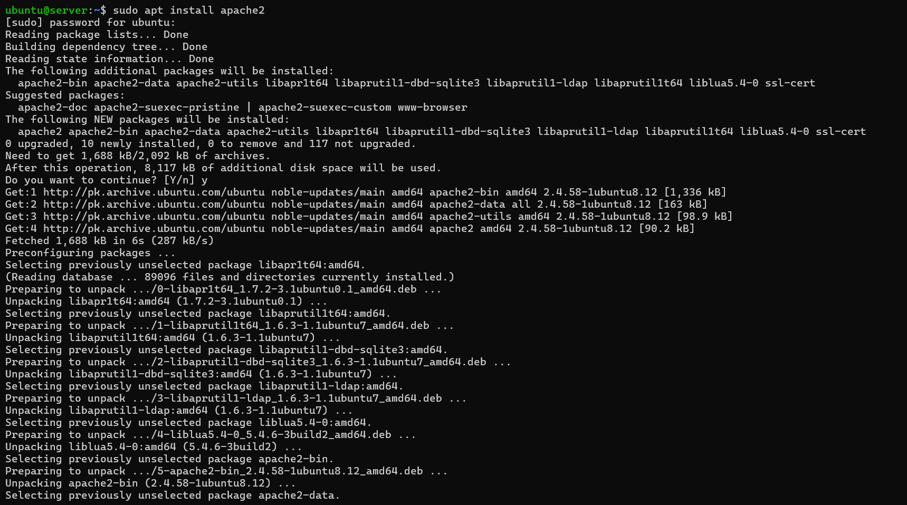

docs reference: https://splunk.github.io/splunk-add-on-for-apache-web-server/Configure/

There were two log format one is `splunk_kv` and second one is `splunk_json`

https://splunk.github.io/splunk-add-on-for-apache-web-server/Configure/

```
LogFormat "time=%{%s}t.%{usec_frac}t, bytes_in=%I, bytes_out=%O, cookie=\"%{Cookie}i\", server=%v, dest_port=%p, http_content_type=\"%{Content-type}i\", http_method=\"%m\", http_referrer=\"%{Referer}i\", http_user_agent=\"%{User-agent}i\", ident=\"%l\", response_time_microseconds=%D, client=%h, status=%>s, uri_path=\"%U\", uri_query=\"%q\", user=\"%u\"" splunk_kv
```

```
#LogFormat "{\"time\":\"%{%s}t.%{usec_frac}t\", \"bytes_in\":\"%I\", \"bytes_out\":\"%O\", \"cookie\":\"%{Cookie}i\", \"server\":\"%v\", \"dest_port\":\"%p\", \"http_content_type\":\"%{Content-type}i\", \"http_method\":\"%m\", \"http_referrer\":\"%{Referer}i\", \"http_user_agent\":\"%{User-agent}i\", \"ident\":\"%l\", \"response_time_microseconds\":\"%D\", \"client\":\"%h\", \"status\":\"%>s\", \"uri_path\":\"%U\", \"uri_query\":\"%q\", \"user\":\"%u\"}" splunk_json
```

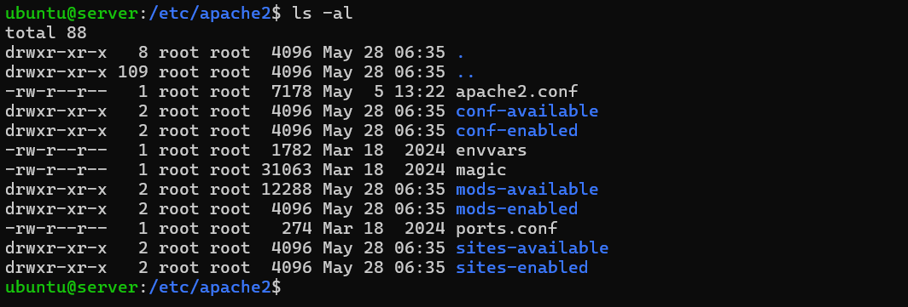

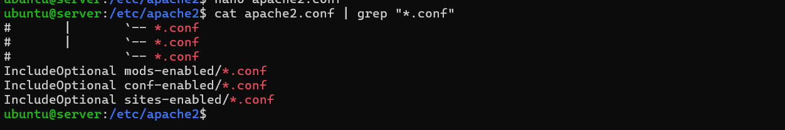

This means it will load all the `configurations` files loaded at runtime without overwriting other `conf` files

Now we will create our config files in `conf-available` folder and then put it into `conf-enabled` folder.

```shell
 sudo nano log-splunk.conf
```

We need to paste this into the `log-splunk.conf` file and need to comment the **splunk-kv** format

```txt
<IfModule log_config_module> # # The following directives define some format nicknames for use with # a CustomLog directive (see below). # LogFormat "%h %l %u %t \"%r\" %>s %b \"%{Referer}i\" \"%{User-Agent}i\"" combined LogFormat "%h %l %u %t \"%r\" %>s %b" common <IfModule logio_module> # You need to enable mod_logio.c to use %I and %O LogFormat "time=%{%s}t.%{usec_frac}t, bytes_in=%I, bytes_out=%O, cookie=\"%{Cookie}i\", server=%v, dest_port=%p, http_content_type=\"%{Content-type}i\", http_method=\"%m\", http_referrer=\"%{Referer}i\", http_user_agent=\"%{User-agent}i\", ident=\"%l\", response_time_microseconds=%D, client=%h, status=%>s, uri_path=\"%U\", uri_query=\"%q\", user=\"%u\"" splunk_kv #LogFormat "{\"time\":\"%{%s}t.%{usec_frac}t\", \"bytes_in\":\"%I\", \"bytes_out\":\"%O\", \"cookie\":\"%{Cookie}i\", \"server\":\"%v\", \"dest_port\":\"%p\", \"http_content_type\":\"%{Content-type}i\", \"http_method\":\"%m\", \"http_referrer\":\"%{Referer}i\", \"http_user_agent\":\"%{User-agent}i\", \"ident\":\"%l\", \"response_time_microseconds\":\"%D\", \"client\":\"%h\", \"status\":\"%>s\", \"uri_path\":\"%U\", \"uri_query\":\"%q\", \"user\":\"%u\"}" splunk_json #LogFormat "%h %l %u %t \"%r\" %>s %b \"%{Referer}i\" \"%{User-Agent}i\" %I %O" combinedio </IfModule> # # The location and format of the access logfile (Common Logfile Format). # If you do not define any access logfiles within a <VirtualHost> # container, they will be logged here. Contrariwise, if you *do* # define per-<VirtualHost> access logfiles, transactions will be # logged therein and *not* in this file. # # CustomLog "logs/access_log" common # # If you prefer a logfile with access, agent, and referer information # (Combined Logfile Format) you can use the following directive. # CustomLog "logs/access_log" splunk_kv #CustomLog "logs/access_log" splunk_json #CustomLog "logs/access_log" combined </IfModule>
```

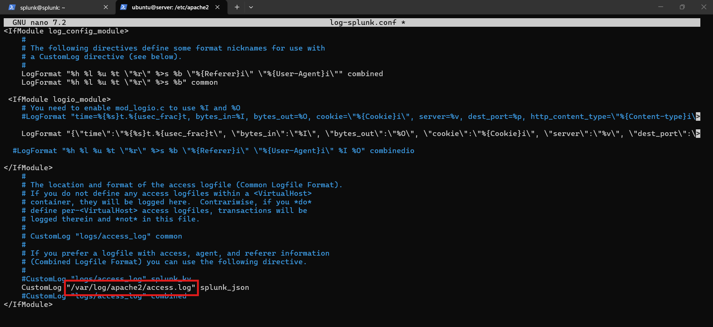

Need to change the path for splunk `.json` for apache2 access log path.

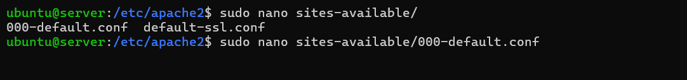
Now we need to specify our splunk  json log format there.

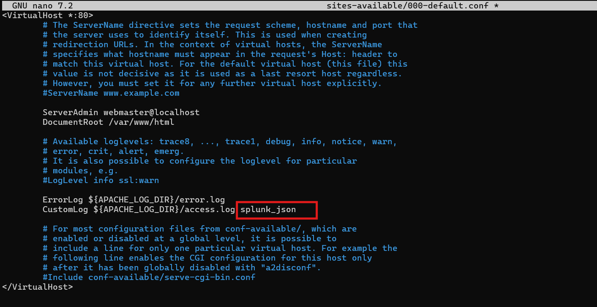

Now we need to enable the configuration. So we will use apache2 config enable command with the log file

```shell
sudo a2enconf log-splunk
```

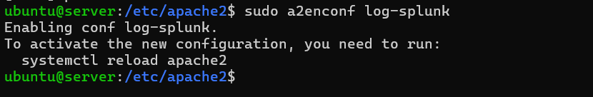

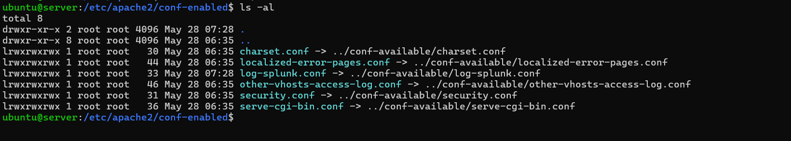

As we can see here log-splunk file is enabled. Now we need to reload apache2

```shell
sudo systemctl reload apache2
```

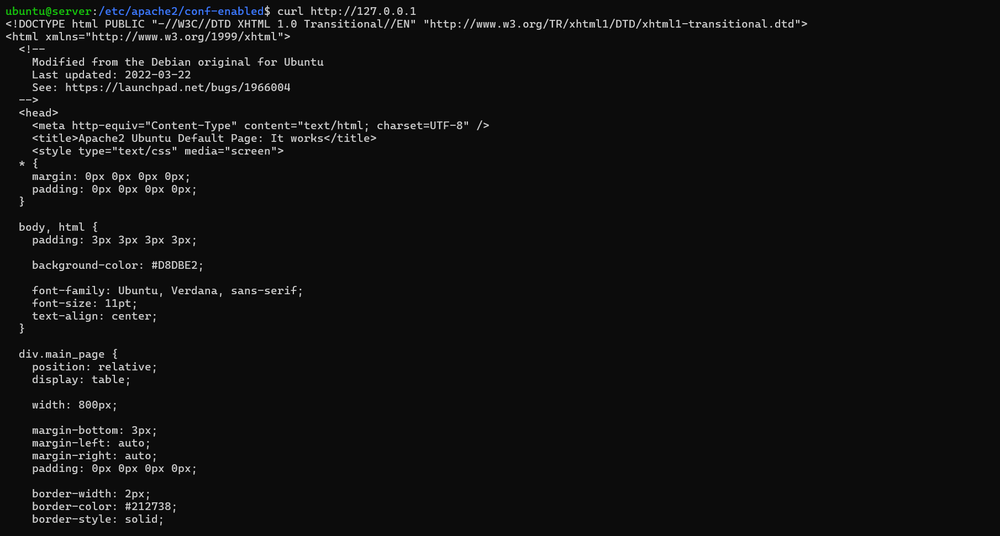

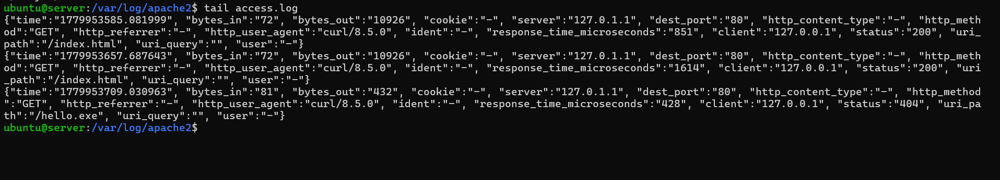

Now we need to install add-on for Splunk UI. Here we need to add splunk website creds to install the app.

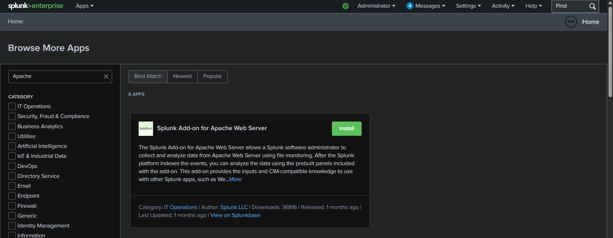

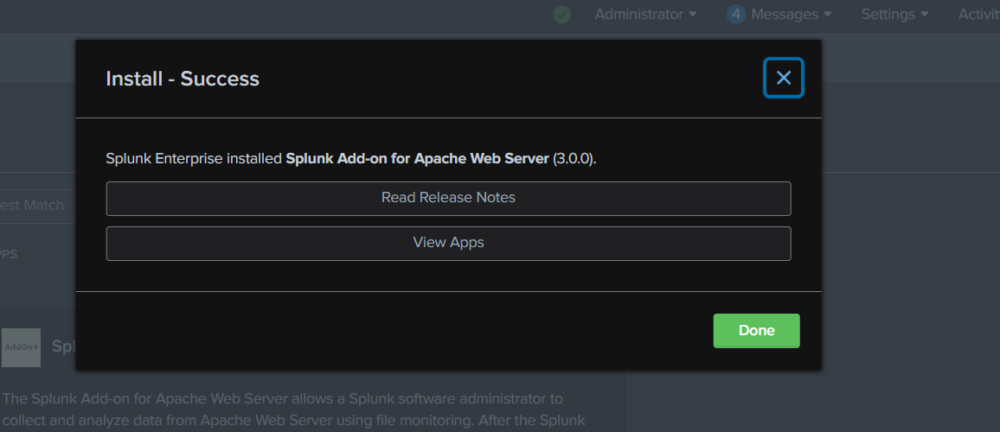

Now we need to add `inputs.conf` for shipping the logs.

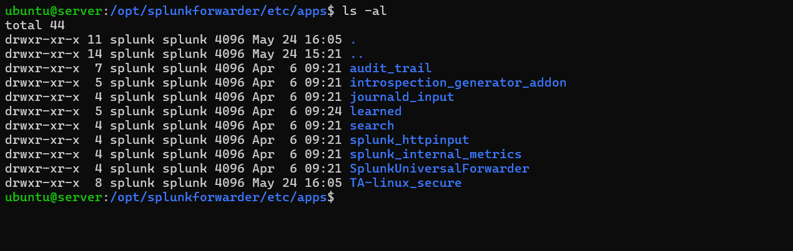

As we can see here we don't have any folder related to `apache2` so we need to create one.

```shell
apache_inputs > default > inputs.conf
```

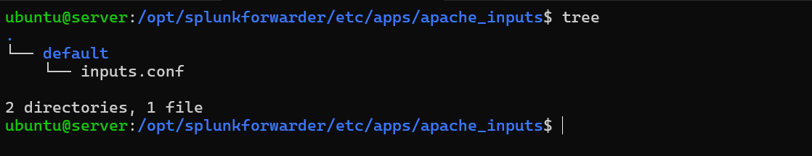

We need to add this in `inputs.conf`

```conf
[monitor:///var/log/apache2/access.log]
sourcetype = apache:access:json
index = test
disabled = 0
```

 As `outpus.conf` is already configured.

Now we need to restart splunk to implement the changes.

```shell
sudo /opt/splunkforwarder/bin/splunk restart
```

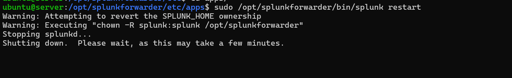

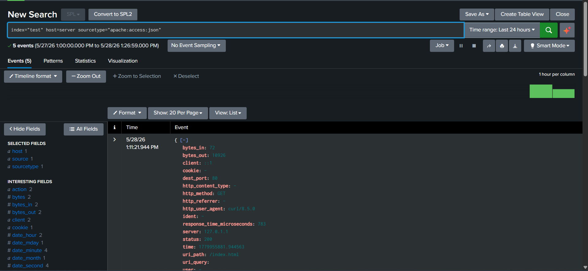


